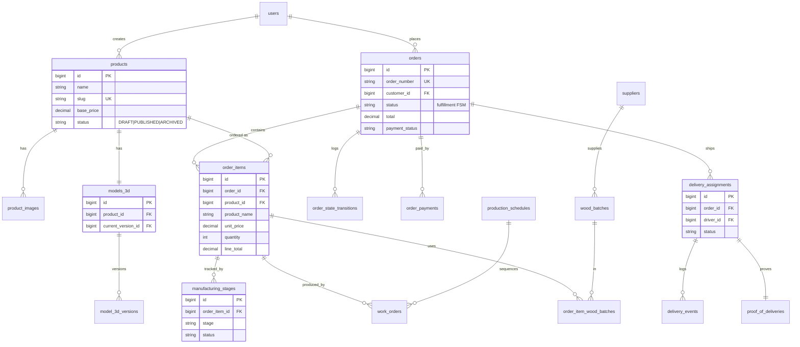

# Data Model (ERD) — Cedarside Holding Corp.

PostgreSQL 16. Single-tenant: **one furniture company**, its staff, and its customers.
Two representations: **DBML** (paste into dbdiagram.io) and a **Mermaid ER diagram**.

> **Domain (revised):** the system has two distinct concerns, previously conflated:
> 1. **Products (catalog)** — the company (Admin/Owner) prepares products, each with a 3D model, and **publishes** them. Only published products are visible to customers.
> 2. **Orders (fulfillment)** — a customer places a **multi-item** order against published products; the order moves through a **manufacturing/delivery FSM**, each transition owned by a specific staff role.
> The 3D model belongs to the **Product**, not the order (the company designs it once; customers view it).

---

## Design notes

- **Not multi-tenant.** No company/tenant table — a single company owns the whole dataset.
- **Customers are users** with the `customer` role. Staff are users with staff roles.
- **Catalog:** `products` (+ `product_images`, + one `models_3d` with versions) has a **DRAFT → PUBLISHED → ARCHIVED** lifecycle. Publish is guarded (needs a 3D model + price).
- **Orders** carry **line items** (`order_items`) snapshotting product name + unit price at order time (history stays correct even if the product later changes). Order state is the **fulfillment FSM**; the state graph + per-role ownership live in [FSM.md](./FSM.md).
- **Production is per item.** `manufacturing_stages` and `work_orders` reference `order_items` (each physical piece is tracked through cutting→…→QC); the order-level FSM aggregates.
- **Pricing (basic):** product `base_price`; order `subtotal`/`delivery_fee`/`total`; `order_payments` logs each payment (who recorded it → BIR/DTI audit, caps §2.4). `payment_status` = UNPAID/PARTIAL/PAID.
- **PII encryption (RA 10173):** `users.phone/address`, `orders.delivery_address`, delivery recipient — encrypted at rest.
- **Archiving:** terminal orders (COMPLETED/CANCELLED) > 1yr → `orders_archive` via the scheduled move job.
- **spatie** (`roles`, `permissions`, pivots) + **Laravel** (`notifications`, `personal_access_tokens`, `jobs`) shown abbreviated.

---

## DBML

```dbml
// ---------- Identity & Access ----------
Table users {
  id            bigint      [pk, increment]
  name          varchar
  email         varchar     [unique, not null]
  password      varchar     [not null]
  phone         text        [note: 'encrypted']
  address       text        [note: 'encrypted']
  company       varchar     [null]
  is_active     boolean     [default: true]
  created_at    timestamptz
  updated_at    timestamptz
}
// spatie + sanctum tables omitted

// ---------- Catalog ----------
Table products {
  id             bigint     [pk, increment]
  name           varchar    [not null]
  slug           varchar    [unique, not null]
  description    text       [null]
  category       varchar    [null, note: 'dropdown — config/catalog.php']
  material       varchar    [null, note: 'dropdown']
  wood_type      varchar    [null, note: 'dropdown']
  finish         varchar    [null, note: 'dropdown']
  width_cm       decimal    [null]
  depth_cm       decimal    [null]
  height_cm      decimal    [null]
  weight_kg      decimal    [null]
  base_price     decimal    [not null, default: 0]
  lead_time_days int        [null, note: 'production estimate']
  status         varchar    [not null, default: 'DRAFT', note: 'DRAFT|PUBLISHED|ARCHIVED']
  published_at   timestamptz [null]
  created_by     bigint     [ref: > users.id, null]
  created_at     timestamptz
  updated_at     timestamptz
  indexes { status }
}
// Dropdown option lists (category/material/wood_type/finish) live in
// backend config/catalog.php and are served via GET /api/v1/products/options.

Table product_images {
  id            bigint      [pk, increment]
  product_id    bigint      [ref: > products.id, not null]
  path          varchar     [not null]
  sort_order    int         [default: 0]
  is_primary    boolean     [default: false]
  created_at    timestamptz
  updated_at    timestamptz
}

// 3D model now belongs to the PRODUCT (one per product, versioned).
Table models_3d {
  id                  bigint    [pk, increment]
  product_id          bigint    [ref: > products.id, not null]
  current_version_id  bigint    [ref: > model_3d_versions.id, null]
  created_at          timestamptz
  updated_at          timestamptz
  indexes { (product_id) [unique] }
}

Table model_3d_versions {
  id            bigint      [pk, increment]
  model_id      bigint      [ref: > models_3d.id, not null]
  version       int         [not null]
  file_path     varchar     [not null]
  format        varchar     [not null, note: 'glb | obj']
  file_size     bigint      [null]
  change_log    text        [null]
  uploaded_by   bigint      [ref: > users.id, not null]
  created_at    timestamptz
  updated_at    timestamptz
  indexes { (model_id, version) [unique] }
}

// ---------- Orders (fulfillment) ----------
Table orders {
  id                bigint     [pk, increment]
  order_number      varchar    [unique, not null]
  customer_id       bigint     [ref: > users.id, not null]
  status            varchar    [not null, default: 'PLACED', note: 'FSM state']
  subtotal          decimal    [not null, default: 0]
  delivery_fee      decimal    [not null, default: 0]
  total             decimal    [not null, default: 0]
  downpayment       decimal    [not null, default: 0]
  amount_paid       decimal    [not null, default: 0]
  payment_status    varchar    [not null, default: 'UNPAID', note: 'UNPAID|PARTIAL|PAID']
  delivery_address  text       [null, note: 'encrypted']
  notes             text       [null]
  placed_at         timestamptz [null]
  confirmed_at      timestamptz [null]
  delivered_at      timestamptz [null]
  created_at        timestamptz
  updated_at        timestamptz
  indexes { status, customer_id, created_at }
}

Table order_items {
  id            bigint      [pk, increment]
  order_id      bigint      [ref: > orders.id, not null]
  product_id    bigint      [ref: > products.id, null, note: 'null if product later deleted']
  product_name  varchar     [not null, note: 'snapshot at order time']
  unit_price    decimal     [not null, note: 'snapshot']
  quantity      int         [not null, default: 1]
  line_total    decimal     [not null]
  created_at    timestamptz
  updated_at    timestamptz
  indexes { order_id }
}

Table order_state_transitions {
  id           bigint      [pk, increment]
  order_id     bigint      [ref: > orders.id, not null]
  from_state   varchar     [null]
  to_state     varchar     [not null]
  actor_id     bigint      [ref: > users.id, null]
  note         text        [null]
  created_at   timestamptz
  updated_at   timestamptz
  indexes { order_id }
}

Table order_payments {
  id            bigint      [pk, increment]
  order_id      bigint      [ref: > orders.id, not null]
  amount        decimal     [not null]
  method        varchar     [null, note: 'cash|transfer|...']
  recorded_by   bigint      [ref: > users.id, null, note: 'audit: who posted it']
  note          text        [null]
  created_at    timestamptz
  updated_at    timestamptz
}

Table orders_archive {
  id                bigint     [pk]
  order_number      varchar
  customer_id       bigint
  status            varchar
  total             decimal
  archived_at       timestamptz
  created_at        timestamptz
}

// ---------- Manufacturing (per order item) ----------
Table manufacturing_stages {
  id                bigint     [pk, increment]
  order_item_id     bigint     [ref: > order_items.id, not null]
  stage             varchar    [not null, note: 'cutting|assembly|sanding|finishing|qc']
  status            varchar    [not null, default: 'pending']
  operator_id       bigint     [ref: > users.id, null]
  expected_minutes  int        [null]
  started_at        timestamptz [null]
  ended_at          timestamptz [null]
  is_delayed        boolean    [default: false]
  qc_passed         boolean    [null]
  notes             text       [null]
  created_at        timestamptz
  updated_at        timestamptz
  indexes { (order_item_id, stage) }
}

Table production_schedules {
  id            bigint      [pk, increment]
  generated_by  bigint      [ref: > users.id, null]
  strategy      varchar     [null]
  created_at    timestamptz
  updated_at    timestamptz
}

Table work_orders {
  id                bigint     [pk, increment]
  order_item_id     bigint     [ref: > order_items.id, not null]
  schedule_id       bigint     [ref: > production_schedules.id, null]
  assigned_to       bigint     [ref: > users.id, null]
  sequence          int        [null]
  scheduled_start   timestamptz [null]
  scheduled_end     timestamptz [null]
  status            varchar    [default: 'pending']
  created_at        timestamptz
  updated_at        timestamptz
  indexes { order_item_id }
}

// ---------- Traceability ----------
Table suppliers {
  id            bigint      [pk, increment]
  name          varchar     [not null]
  cert_number   varchar     [null]
  created_at    timestamptz
  updated_at    timestamptz
}

Table wood_batches {
  id            bigint      [pk, increment]
  batch_code    varchar     [unique, not null]
  supplier_id   bigint      [ref: > suppliers.id, null]
  received_at   timestamptz [null]
  created_at    timestamptz
  updated_at    timestamptz
}

Table order_item_wood_batches {
  id            bigint      [pk, increment]
  order_item_id bigint      [ref: > order_items.id, not null]
  wood_batch_id bigint      [ref: > wood_batches.id, not null]
  indexes { (order_item_id, wood_batch_id) [unique] }
}

// ---------- Delivery (per order) ----------
Table delivery_assignments {
  id             bigint      [pk, increment]
  order_id       bigint      [ref: > orders.id, not null]
  coordinator_id bigint      [ref: > users.id, null]
  driver_id      bigint      [ref: > users.id, null]
  batch_label    varchar     [null]
  status         varchar     [default: 'assigned']
  assigned_at    timestamptz [null]
  created_at     timestamptz
  updated_at     timestamptz
  indexes { order_id, driver_id }
}

Table delivery_events {
  id                     bigint      [pk, increment]
  delivery_assignment_id bigint      [ref: > delivery_assignments.id, not null]
  type                   varchar     [not null]
  lat                    decimal     [null]
  lng                    decimal     [null]
  manual_location        varchar     [null]
  note                   text        [null]
  created_by             bigint      [ref: > users.id, null]
  created_at             timestamptz
  updated_at             timestamptz
}

Table proof_of_deliveries {
  id                     bigint      [pk, increment]
  delivery_assignment_id bigint      [ref: > delivery_assignments.id, not null]
  photo_path             varchar     [not null]
  signature_path         varchar     [null]
  recipient_name         text        [null, note: 'encrypted']
  delivered_at           timestamptz [not null]
  created_at             timestamptz
  updated_at             timestamptz
}

// ---------- Analytics ----------
Table kpi_snapshots {
  id            bigint      [pk, increment]
  metric        varchar     [not null]
  value         decimal     [not null]
  dimension     varchar     [null]
  captured_for  date        [not null]
  created_at    timestamptz
  updated_at    timestamptz
  indexes { (metric, captured_for) }
}
```

---

## Mermaid ER diagram



---

## Table → module ownership

| Module | Owns tables |
|---|---|
| Users | `users` + spatie |
| **Products (Catalog)** | `products`, `product_images`, `models_3d`, `model_3d_versions` |
| Orders | `orders`, `order_items`, `order_state_transitions`, `order_payments`, `orders_archive` |
| Manufacturing | `manufacturing_stages`, `work_orders`, `production_schedules`, `suppliers`, `wood_batches`, `order_item_wood_batches` |
| Delivery | `delivery_assignments`, `delivery_events`, `proof_of_deliveries` |
| Analytics | `kpi_snapshots` |
