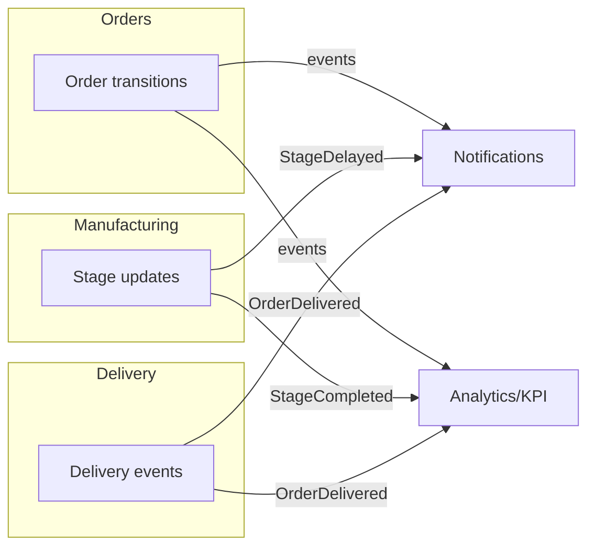

# Event Catalog

Modules communicate through **domain events**, never direct calls — this is what keeps them loosely coupled and independently testable (Dependency Inversion). Producers dispatch; listeners in other modules react. Listeners that do I/O (email, heavy KPI math) are **queued**.

---

## Events → listeners

| Event | Emitted by | Payload (key fields) | Listeners (module → action) | Queued? |
|---|---|---|---|---|
| `OrderSubmittedForApproval` | Orders FSM | order, current version | Notifications → notify customer to review 3D | yes |
| `OrderApproved` | Orders FSM | order, version, approver | Notifications → notify prod mgr; Analytics → mark approval time | yes |
| `OrderChangesRequested` | Orders FSM | order | Notifications → notify uploader | yes |
| `OrderCancelled` | Orders FSM | order, reason | Notifications → notify customer + staff | yes |
| `OrderProductionStarted` | Orders FSM | order, work orders | Notifications → notify customer; Analytics → lead-time start | yes |
| `OrderReadyForQc` | Orders FSM | order | Notifications → notify QA | yes |
| `OrderPassedQc` | Orders FSM | order | Notifications → notify logistics; Analytics → defect data | yes |
| `OrderFailedQc` | Orders FSM | order, defect notes | Notifications → notify prod mgr; Analytics → rework++ | yes |
| `OrderReworkStarted` | Orders FSM | order | Notifications → notify operatives | yes |
| `OrderOutForDelivery` | Orders FSM | order, assignment | Notifications → notify customer ("Out for Delivery") | yes |
| `OrderDelivered` | Orders FSM / Delivery | order, proof, delivered_at | Notifications → **delivery email** to customer; Analytics → on-time calc; Orders → auto-close eligible | yes |
| `OrderClosed` | Orders FSM | order | Analytics → finalize lead time | yes |
| `ManufacturingStageStarted` | Manufacturing | order, stage, operator | Analytics → stage timing; (broadcast to shop floor) | yes |
| `ManufacturingStageCompleted` | Manufacturing | order, stage, duration | Analytics → OTE/stage KPIs; may trigger `OrderReadyForQc` | yes |
| `ManufacturingStageDelayed` | Manufacturing (delay detector) | order, stage, over-by | Notifications → **alert prod mgr** ("Sanding delayed"); (broadcast red) | yes |
| `WorkOrderScheduled` | Manufacturing (DSS) | work orders, sequence | Notifications → notify assigned operative | yes |
| `DeliveryLocationLogged` | Delivery | assignment, lat/lng/manual | (broadcast to logistics map) | no |

---

## Real-time (broadcast) vs notification

Some events **also broadcast** over Pusher for live UI (marked "broadcast" above) — these implement Laravel's `ShouldBroadcast` on a **private channel**:

| Broadcast event | Channel | Who subscribes |
|---|---|---|
| stage started/completed/delayed | `private-shop-floor` | Prod Mgr, Operative |
| order transition | `private-order.{orderId}` | that order's customer + staff |
| delivery location/status | `private-deliveries` | Logistics Coordinator |

Channel authorization (`routes/channels.php`) checks the subscriber's role + ownership, so RBAC is enforced on the socket too.

---

## Conventions

- Events are immutable DTakO-style value objects in `Domain/<Module>/Events/`.
- Listeners live in the **consuming** module, registered in that module's service provider — so adding a listener never touches the producer.
- A listener failing (e.g. email down) must not roll back the transition — queued + retried independently.
