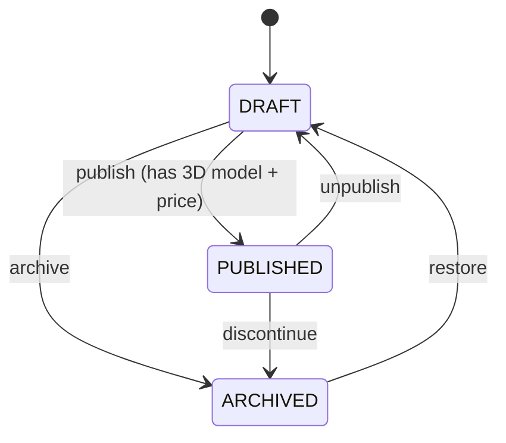
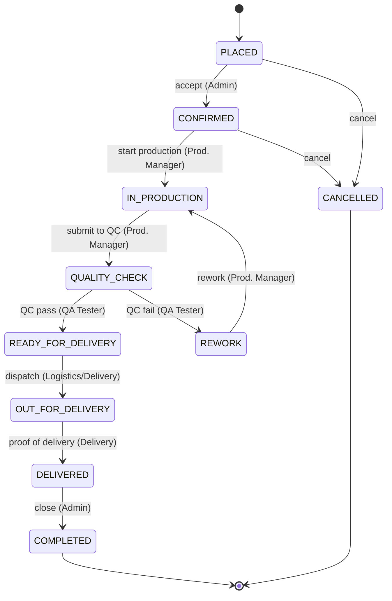

# State Machines — Product & Order

Two independent lifecycles. Both use the **State pattern** (one class per state; adding a state = new class, Open/Closed) with `GuardRegistry` for data preconditions. Every order transition is written to `order_state_transitions` (audit). **Order transitions are role-owned** — this is the real-world production simulation.

---

## 1. Product lifecycle (catalog — company-side)

Owned by **Admin/Owner** (catalog manager). Only `PUBLISHED` products are visible to customers.



| Transition | Guard | Role |
|---|---|---|
| DRAFT → PUBLISHED | has a 3D model version **and** `base_price > 0` | Admin/Owner (`products.publish`) |
| PUBLISHED → DRAFT | — | Admin/Owner |
| * → ARCHIVED | not referenced by an active order (optional) | Admin/Owner |
| ARCHIVED → DRAFT | — | Admin/Owner |

---

## 2. Order fulfillment lifecycle

A customer places a multi-item order against published products; staff move it through production and delivery. Each transition is owned by the role that performs that real-world job.



### States
| State | Meaning | Terminal |
|---|---|---|
| `PLACED` | Customer submitted the order | no |
| `CONFIRMED` | Company accepted (downpayment recorded) | no |
| `IN_PRODUCTION` | On the shop floor; items tracked through stages | no |
| `QUALITY_CHECK` | Finished; QA inspecting | no |
| `REWORK` | QC failed; back to production | no |
| `READY_FOR_DELIVERY` | Passed QC; awaiting dispatch | no |
| `OUT_FOR_DELIVERY` | Picked up / en route | no |
| `DELIVERED` | Proof of delivery captured | no |
| `COMPLETED` | Closed | **yes** |
| `CANCELLED` | Cancelled pre-production | **yes** |

### Transition ownership (role-per-step)
The transition is allowed only if the actor holds one of the roles below (customers also constrained to their **own** order). Enforced in `OrderPolicy` via a transition→roles map — **no single blanket "transition" permission**.

| From → To | Role(s) | Guard | Event |
|---|---|---|---|
| → PLACED | Customer | cart has ≥1 published item | `OrderPlaced` |
| PLACED → CONFIRMED | Admin/Owner | — | `OrderConfirmed` |
| PLACED → CANCELLED | Admin, **Customer (own)** | — | `OrderCancelled` |
| CONFIRMED → IN_PRODUCTION | Production Manager | — | `OrderProductionStarted` |
| CONFIRMED → CANCELLED | Admin | — | `OrderCancelled` |
| IN_PRODUCTION → QUALITY_CHECK | Production Manager | all items' `finishing` done | `OrderReadyForQc` |
| QUALITY_CHECK → READY_FOR_DELIVERY | QA Tester | items' QC recorded pass | `OrderPassedQc` |
| QUALITY_CHECK → REWORK | QA Tester | — | `OrderFailedQc` |
| REWORK → IN_PRODUCTION | Production Manager | — | `OrderReworkStarted` |
| READY_FOR_DELIVERY → OUT_FOR_DELIVERY | Logistics Coordinator, Delivery Personnel | delivery assignment exists | `OrderOutForDelivery` |
| OUT_FOR_DELIVERY → DELIVERED | Delivery Personnel | proof-of-delivery exists | `OrderDelivered` |
| DELIVERED → COMPLETED | Admin / system | — | `OrderCompleted` |

Illegal transitions (not in the graph) or transitions attempted by the wrong role are rejected — `422` (bad transition) / `403` (wrong role).

---

## Class shape (order states)

```
app/Domain/Orders/States/
├── OrderStateContract.php        (name, allowedTransitions, canTransitionTo)
├── AbstractOrderState.php
├── PlacedState.php  ConfirmedState.php  InProductionState.php
├── QualityCheckState.php  ReworkState.php  ReadyForDeliveryState.php
├── OutForDeliveryState.php  DeliveredState.php  CompletedState.php  CancelledState.php
├── OrderStateFactory.php         (enum → class)
├── GuardRegistry.php             (data guards, per (from,to))
└── TransitionOwnership.php       (NEW: (from,to) → allowed roles)
```

`TransitionOrderAction` = the single mutation path: check graph → check role ownership (via `OrderPolicy`) → run data guards → persist state + write audit + emit event, atomically.

Manufacturing sub-stages (cutting→assembly→sanding→finishing→qc) are **records on `order_items`**, not FSM states — they live inside `IN_PRODUCTION` and their completion feeds the `→ QUALITY_CHECK` guard.

Events map to Notifications/Analytics per [EVENTS.md](./EVENTS.md).
